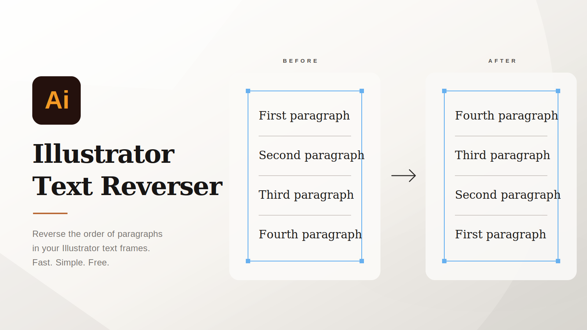

# Illustrator Text Reverser

<p align="center">
  
</p>


A lightweight Adobe Illustrator workflow utility that reverses the **order of paragraphs inside selected text frames** in one command.

Built for repetitive production-design tasks where manually cutting, moving, and reordering copy is slow, error-prone, or impractical across multiple text objects.

> **Current release: v2.0.0** — adds multi-frame processing, grouped-text support, safer validation, and cleaner failure handling.

## Demo

[▶ Watch the Illustrator Text Reverser demo](./illustrator-text-reverser.mp4)

## The problem

Illustrator is excellent for visual layout, but small text-production tasks can become repetitive very quickly. Reversing a multi-line list or paragraph sequence normally means manually moving each block of copy.

This script turns that repeated operation into a single Illustrator command.

### Before

```text
First paragraph
Second paragraph
Third paragraph
```

### After

```text
Third paragraph
Second paragraph
First paragraph
```

## What v2 does

- **Reverses paragraph order** without reversing individual characters.
- **Processes multiple selected text frames** in a single run.
- **Finds text frames inside selected groups** recursively.
- **Skips locked or hidden text frames** instead of interrupting the whole operation.
- **Preserves trailing paragraph breaks** so terminal spacing does not jump to the start of the copy.
- **Handles CR, LF, and CRLF line endings** instead of assuming one separator format.
- **Reports batch results** when multiple objects are processed or some objects are skipped.
- Uses **ExtendScript-compatible JavaScript** with no external dependencies.

## Usage

1. Open an Adobe Illustrator document.
2. Select one or more text frames with the **Selection Tool**.
3. You can also select a group that contains text frames.
4. Run:

   `File > Scripts > TextReverseButton`

5. The paragraph order inside each editable selected text frame is reversed.

## Installation

### Quick install

Clone the repository:

```bash
git clone https://github.com/t3zrk/illustrator-text-reverser.git
```

Copy:

```text
scripts/TextReverseButton.jsx
```

into Illustrator's Scripts folder, restart Illustrator, then run it from `File > Scripts`.

For Windows/macOS paths and alternate installation methods, see [INSTALLATION.md](INSTALLATION.md).

### Run without installing

In Illustrator:

`File > Scripts > Other Script...`

Then choose `scripts/TextReverseButton.jsx`.

## How it works

The script follows a deliberately small pipeline:

```text
Illustrator selection
        ↓
Collect selected text frames
        ↓
Traverse selected groups
        ↓
Validate editable frames
        ↓
Split content into paragraphs
        ↓
Reverse paragraph array
        ↓
Write result back to each frame
        ↓
Report skipped / failed batch items
```

The implementation is kept intentionally dependency-free so the `.jsx` file can be dropped directly into Illustrator without a build step or plugin installer.

## Project structure

```text
illustrator-text-reverser/
├── assets/
│   ├── hero.svg                # Editable hero artwork
│   └── hero.png                # Rendered repository hero
├── scripts/
│   └── TextReverseButton.jsx   # Illustrator ExtendScript
├── docs/
│   └── PROJECT-CASE-STUDY.md   # Portfolio-ready project breakdown
├── illustrator-text-reverser.mp4
├── INSTALLATION.md
├── CHANGELOG.md
├── LICENSE.txt
└── README.md
```

## Technical decisions

### Why paragraph reversal instead of character reversal?

The goal is layout reordering, not mirrored or backwards text. Each paragraph remains readable; only its position in the sequence changes.

### Why keep it as ExtendScript?

For a focused Illustrator automation utility, a standalone JSX script has useful advantages:

- no package manager
- no runtime dependencies
- no extension installation flow
- simple source code
- easy portability between workstations

### Why support groups?

Production Illustrator files frequently contain text nested inside grouped layout elements. Recursively collecting text frames makes the utility useful without forcing the designer to ungroup artwork first.

## Compatibility notes

This project targets Adobe Illustrator's ExtendScript/JSX scripting environment.

Because Illustrator rewrites text-frame contents through its scripting API, **heavily mixed character-level styling should be tested on a copy of the artwork before production use**. The script is designed primarily for paragraph-order automation rather than rich-text transformation.

Locked and hidden text frames are intentionally skipped.

## Version history

See [CHANGELOG.md](CHANGELOG.md).

## Portfolio / case study

A concise project breakdown covering the problem, design rationale, technical approach, and skills demonstrated is available in [docs/PROJECT-CASE-STUDY.md](docs/PROJECT-CASE-STUDY.md).

## Tech stack

- Adobe Illustrator
- ExtendScript / JSX
- Illustrator Scripting API
- Git / GitHub

## Author

Created and maintained by [@t3zrk](https://github.com/t3zrk).

## License

MIT License. See [LICENSE.txt](LICENSE.txt).
